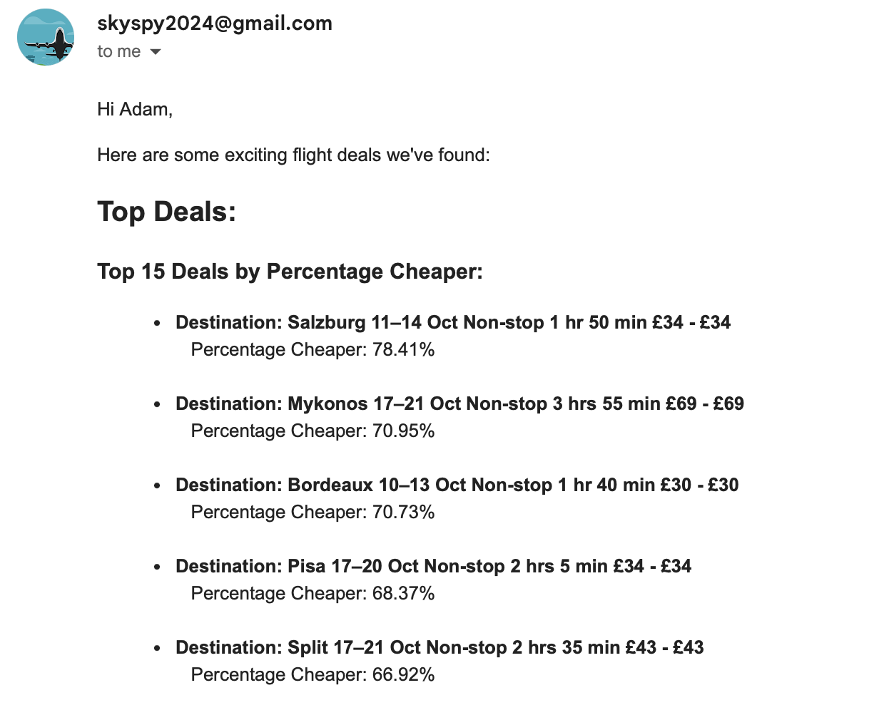

# SkySpy

SkySpy is a Python project aimed at scraping flight data from the Google Flights website and providing users with weekly information on flight prices and insights. The project utilises web scraping techniques to gather data from the Google Flights search results page and presents it in a structured format.  The results are then emailed to users listed on a csv.  Future iterations plan to run this through AWS Lambda to automate running.

## Features

- Scrapes flight data from Google Flights
- Retrieves information such as flight prices, dates, and airlines
- Calculates insights on flight prices compared to typical prices
- Identifies the top 8 cheapest flights and the top 15 flights with the highest percentage discount from the usual cost
- Sends email notifications with flight deals to contacts

## Installation

1. Clone the repository:

   ```bash
   git clone https://github.com/amatt06/SkySpy.git
   ```

2. Navigate to the project directory:

   ```bash
   cd SkySpy
   ```

3. Install Python dependencies:

   ```bash
   pip install -r requirements.txt
   ```

4. Install Node.js dependencies:

   ```bash
   cd courier
   npm install
   ```

## Setup

### Gmail API Authentication

1. Go to the [Google Cloud Console](https://console.cloud.google.com/).
2. Create a new project.
3. Enable the Gmail API for your project.
4. Create OAuth 2.0 credentials and download the `credentials.json` file.
5. Place the `credentials.json` file in the `courier/sensitive_data` directory.

### CSV Contacts File

Ensure you have a CSV file with your contacts. The file should be placed in the `courier/sensitive_data` directory and should be named `contacts.csv`. The CSV file should have the following columns:

- `first_name`
- `email`

### Flight Data JSON File

Flight data will be saved in the `scraper/flight_data` directory and should be named `london_flight_data.json`.

## Usage

1. Run the SkySpy scraper to gather flight data:

   ```bash
   python main.py
   ```

2. The script will scrape flight data and send emails to the contacts listed in the CSV file.

## Example Email

Here is an example of the email that will be sent:



## Trello Board

Follow the progress of SkySpy on our Trello board. You can propose new features, track ongoing tasks, and stay up-to-date with project developments.

[Trello Board](https://trello.com/b/Hg6bh95o/skyspy)

## Disclaimer

This project is intended for educational and research purposes only. The web scraping functionality provided in this project is designed to demonstrate technical concepts and should not be used for commercial purposes or in a manner that violates the terms of service of any website.

Please note that scraping websites like Google Flights may violate their terms of service, and we strongly advise against using this project for scraping live data without proper authorisation. The authors of this project are not responsible for any misuse or legal consequences resulting from the use of this code.

If you require flight data for production or commercial purposes, we recommend using official APIs or data services that provide the data you need in compliance with applicable laws and regulations.
